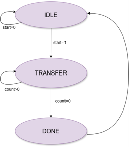
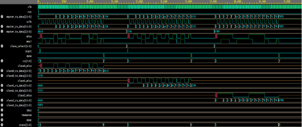

# SPI Protocol Implementation Using Verilog

## Project Overview

This project presents the design and implementation of the Serial Peripheral Interface (SPI) protocol using Verilog HDL. The design consists of one SPI Master and three SPI Slave devices supporting full-duplex synchronous serial communication. The implementation supports configurable SPI modes through CPOL and CPHA settings, programmable clock division, and multi-slave communication using dedicated chip-select lines.

## Features

- Configurable SPI Modes (Mode 0, 1, 2, and 3)
- Full-Duplex Communication
- Multi-Slave Architecture
- Programmable Clock Divider
- Parameterized Data Width
- FSM-Based Control Logic
- Shift Register Based Data Transfer
- Comprehensive Testbench Verification

## SPI Signals

| Signal | Description |
|----------|-------------|
| SCLK | Serial Clock generated by Master |
| MOSI | Master Out Slave In |
| MISO | Master In Slave Out |
| CS/SS | Chip Select / Slave Select |

## System Architecture

The SPI system consists of:
- 1 SPI Master
- 3 SPI Slave Devices
- Shared SCLK, MOSI, and MISO Lines
- Individual Chip Select Signals

Only the selected slave participates in communication while other slaves remain inactive.

## Finite State Machine (FSM)

The SPI Master is implemented using a three-state FSM:

### IDLE
- Waits for start signal
- No slave selected
- SPI clock remains in idle state

### TRANSFER
- Serial data transmission and reception
- Clock generation
- Data shifting and sampling

### DONE
- Transaction completion
- Slave deselection
- Return to IDLE state

## FSM Diagram

## Test Cases

| Test Case | Master TX | Selected Slave | Expected RX |
|------------|-----------|----------------|-------------|
| TC1 | ABCD | Slave0 | 1234 |
| TC2 | 1234 | Slave1 | 5555 |
| TC3 | 6789 | Slave2 | F0F0 |

## Simulation Results

The design was verified through simulation using multiple SPI transactions. Waveforms confirm successful data transmission and reception between the SPI Master and selected Slave devices.

## Simulation Results

## Author

Dharmi Patel
